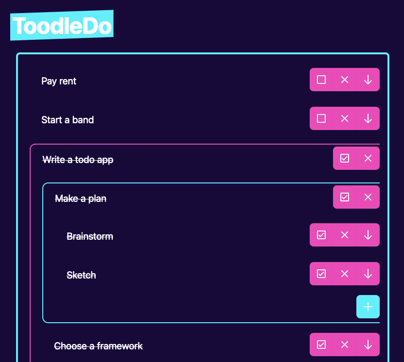

# ToodleDo

## About ToodlDo

ToodleDo is a todo list that allows you to have todo lists for your todo list.

## How to use

1. Double click or press to edit a todo item.

2. Add a todo  
   
3. Add a sub todo list  
   
4. Mark a todo completed  
   
5. Delete a todo  
   
